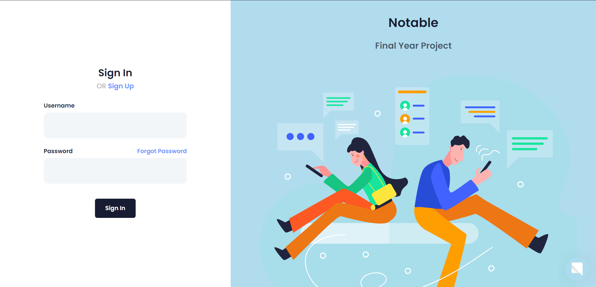
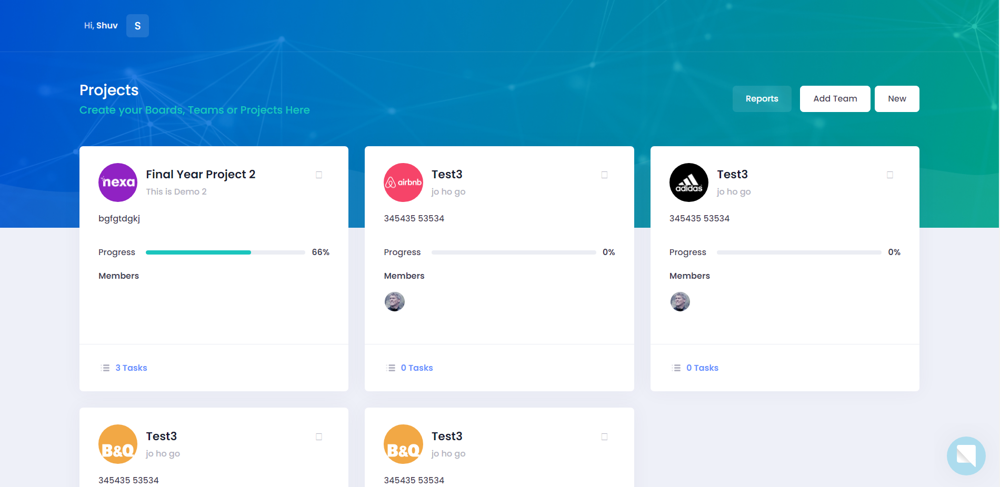
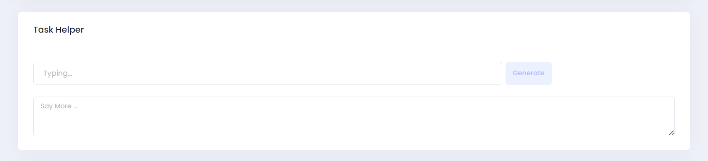

# Notable
### Manage your teams, projects and tasks
### Creating A Virtual Workspace For Personal Or Business Upkeep And Organization Of Data Using AI

### How To Run:
#### This project uses SQLite database, so you can easily run it on your local machine. do this steps:

  1- `pip install -r requirements.txt`

  2- `python manage.py makemigrations`

  3- `python manage.py migrate`

  4- `python manage.py runserver`

# Photos & Features

### Login
* You can sign in or sign up 

### Projects or Teams
* Create your teams or projects and add its members from registered users.
* This project is available for members.
* The creator user will be the admin of project or team.

### Tasks
* Admin user can add a task and assign it to members and himself. 
* Members can see the start time and end time of a task by clicking on it.
* Members can drag and drop their own tasks to change its status.
* Only admin can add/remove the task to/from "Done", "Blocked" and "Deleted".

### Task Helper
* Members can call the BardAPI using the prompt window.
* The api will generate a response taking 7 sec(approx).
* The window can be resized and the results copied.

### Calendar
* Deadline of tasks will be shown in the calendar.
* Only Admin can drag and drop tasks in the calendar to change its deadline.

### Report
* User can see status or all his projects and his status in all projects.

# Notable
